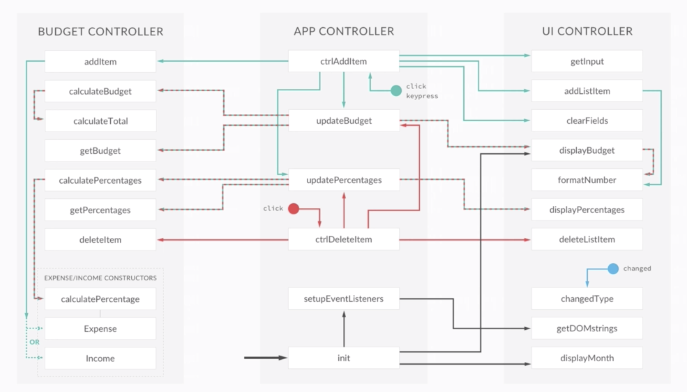

# Budgety

- An app that allows the user to input incomes and expenses.

- The app calculates and displays the percentage of the income that has been spent. 

## Final app architecture

## How to use

1. Fork this repo and clone it to your machine
2. Open `index.html` in your browser
